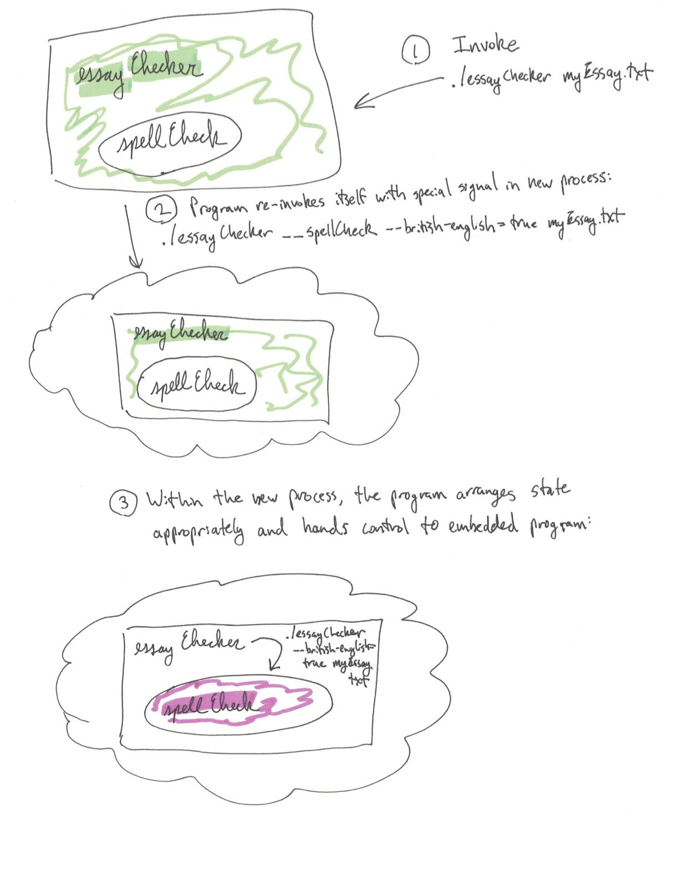
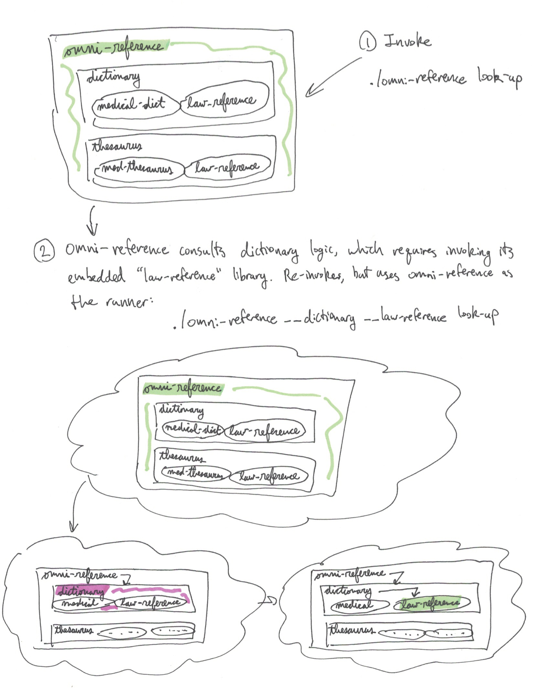

`amalgomate` provides a mechanism that solves this problem elegantly in a novel and automated way. It provides the
capability of *programmatically generating a set of source files that can be compiled safely into a single program* and
a *mechanism for invoking the sub-programs from the main program safely*.

## Programmatic library source generation
As input, `amalgomate` takes a configuration file that specifies the paths to the `main` packages for the programs to be
combined. Here is an example:

```yml
packages:
  deadcode:
    main: github.com/remyoudompheng/go-misc/deadcode
  errcheck:
    main: github.com/kisielk/errcheck
  golint:
    main: github.com/golang/lint/golint
    distance-to-project-pkg: 1
  govet:
    main: github.com/nmiyake/govet
  ineffassign:
    main: github.com/gordonklaus/ineffassign
  outparamcheck:
    main: github.com/palantir/outparamcheck/main/outparamcheck
    distance-to-project-pkg: 2
  unconvert:
    main: github.com/mdempsky/unconvert
  varcheck:
    main: github.com/opennota/check/cmd/varcheck
```

When `amalgomate` is run, it does the following:

* Finds all of the source for the package based on its import path
* Copies the source to an internal directory within the project
* Programmatically re-writes the "main" package into a library package called `amalgomated` and re-writes the `main`
  function to be `AmalgomatedMain` so that it is exported and callable
* Finds any imported instances of packages that are known to store shared global state initialized on package load (such
  as the Go built-in `flag` package), creates a copy of those libraries for the re-written program and updates the
  imports of the program to use the copied library
  * This ensures that any global state that is set on package load is properly preserved
* Creates a new library file that provides an entry point to call all of the re-packaged programs
  * Only this library is exported, which shields the state of the re-packaged programs from other programs

The final product is a programmatically generated set of source files that can be compiled into a single program. The
over-all size of the final program is extremely compact because it is a single compiled executable (for this example,
under 20MB rather than over 90MB). Because it is generated programmatically, it is not susceptible to human error, and
if dependent libraries are updated it is easy to generate a new version of the program with the updated dependent
source.

## Sub-program invocation mechanism
Creating a single small executable that provides the functionality of the sub-programs is important, but it is not
sufficient to solve the problem. As discussed previously, sub-program code that has been converted from a "main" package
is often not safe to run directly because it may perform operations that adversely affect the over-all program if they
are run in-process -- for example, calling `os.Exit` or modifying global variables like `os.Args`.

In order to solve this, `amalgomate` provides a sub-program invocation mechanism. `amalgomate` can be provided with a
special signal on its invocation that instructs it to immediately invoke its sub-program after setting the program state
to be that which is expected by the sub-program. Using this capability, when the over-all program needs the
functionality of its sub-program, it can do so by re-invoking itself with the special invocation signal to run as the
subprogram in a separate process. This also solves the problem of arbitrary binary execution -- as long as the program
binary has not been deleted after invocation and is on the same path, it should generally be possible to re-invoke the
program to get the sub-program functionality.

Concretely, the special invocation signal is `__` (two underscores) followed by the name of the sub-program to invoke.
As an example, assume that the combined program is `essayChecker` and the subprogram is `spellCheck`. Here is an example
workflow:

* Combined program is invoked using `./essayChecker myEssay.txt`
* In the course of its execution, `essayChecker` needs to invoke the `spellCheck` sub-program
* `essayChecker` calls itself with the special invocation signal: 
  `./essayChecker __spellCheck --british-english=true myEssay.txt`
  * The `essayChecker` invocation sees `__spellCheck` and knows that a special invocation is occurring
  * It splices out the special invocation argument so the command-line arguments match those that would be expected by
    the sub-program: `./essayChecker --british-english=true myEssay.txt`
  * It delegates to the library function, which now runs as if it were the only executable
    * Because it is in a sub-process, it can do things like call `os.Exit` and it will only impact the sub-process
* When the self-invocation is finished, the over-all program processes its output and proceeds

Here is a diagram of the workflow described above:



This self-invocation mechanism supports multiple levels of composition -- it provides a mechanism that allows users to
specify the program that should be invoked and the signal that should be used for self-invocation. This allows
self-invoking programs to be composed, even if there is only one program over-all.

Example:

* `dictionary` is a program that uses `amalgomate` to combine several independent dictionary programs:
  * `medical-dict`
  * `law-reference`
* `thesaurus` is a program that uses `amalgomate` to combine several independent dictionary program:
  * `med-thesaurus`
  * `law-reference`
* `omni-reference` is a program that uses `dictionary` and `thesaurus` as libraries using the `amalgomate` invocation framework

Because it uses `amalgomate`, when `dictionary` is run as a stand-alone program, it re-invokes itself to invoke its
sub-program functionality: `./dictionary look-up` -> `./dictionary __medical-dict look-up ...`

However, when it is embedded in `omni-reference`, it can't re-invoke `./dictionary` (because it doesn't exist). It can't
attach its self-commands directly to the top-level either, since that could cause conflicts (for example, `dictionary`
and `thesaurus` both embed a program named `law-reference`, but they may invoke it in different ways).

`amalgomate` provides a mechanism to resolve this by allowing a runner to be provided. The runner can namespace based on 
the `amalgomate`-compatible libraries. The scenario above is thus resolved using the following invocation:

`./omni-reference look-up` -> `./omni-reference __dictionary __law-reference look-up`

Here is a diagram that outlines the process:



In this manner, `amalgomate` supports composition at multiple levels. Beyond just being possible in theory, `amalgomate`
provides a specific mechanism that enables this kind of library construction in a general manner.

## Generalizability
`amalgomate` is a fully working implementation of this mechanism for the Go programming language. However, this same
mechanism should be applicable to any programming languages that generates binaries through compilation, and should
provide the benefit of generating smaller executables that can invoke sub-program functionality in a safe and reliable
manner.
